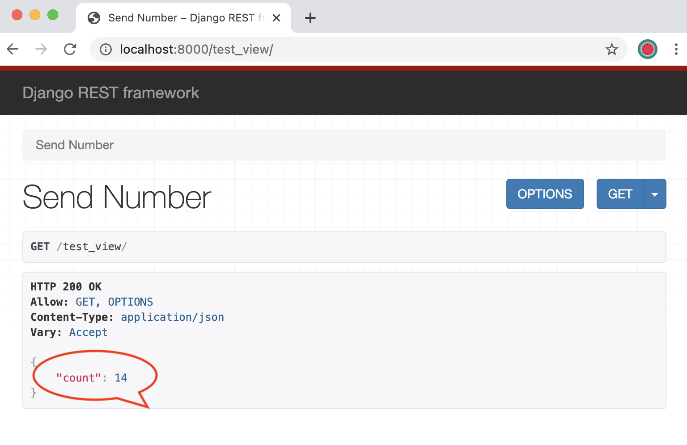

# Simple Django application with Redis backend

Our Application is designed as two components.

Components:
1. Redis Database
2. Django Application

Frontend application is designed to be stateless. This should allow us to use [Horizontal Pod Autoscaler](https://kubernetes.io/docs/tasks/run-application/horizontal-pod-autoscale/) for efficent scalling. 

Backend DB (Redis) is deployed in master-slave mode using [Bitnami's Redis helm chart](https://github.com/helm/charts/tree/master/stable/redis). This should give us an highly available(HA) Redis DB cluster.

Each component will be deployed in its own namespaces(`db-ns`, `app-ns`) for better RBAC. So two teams can work with simplified RBAC. To reduce the surface area of attacks, we will use limited privilages and service accounts.


---



---
## Redis Database

*  Create a namespace for Redis pods
```
kubectl create namespace db-ns
```

* Deploy Redis using `bitnami/redis` helm chart.

```
helm install my-redis bitnami/redis --set password=secretpassword -n db-ns
```


---
## Django Application

*  Create a namespace for Redis pods
```
kubectl create ns app-ns
```

* Copy over the Redis secret from `db-ns` namespace to `app-ns` namespace.
This is not correct approach. I would prefer moving sensitive data to external secrets manager(Ex: Hashicorp Vault). Or use a ServiceAccount which can read secrets from `db-ns` namespace.
```
kubectl create secret generic my-redis -napp-ns --from-literal=redis-password=`kubectl get secret/my-redis -n db-ns -ojsonpath='{.data.redis-password}' | base64 -D`

```

* Create the deployment for our django app 
```
kubectl create deploy myapp --image=bhavyabindela/testapp -n app-ns --replicas=2 --port=8000

kubectl set env --from=secret/my-redis deploy/myapp -napp-ns

kubectl set env deploy/myapp -napp-ns REDIS_HOST=my-redis-master.db-ns.svc.cluster.local REDIS_PORT=6379 
```


* Our application can auto scale horizantlly, so set the smaller resource limits.
```
kubectl set resources deployment myapp -napp-ns --limits=cpu=2000m,memory=2Gi --requests=cpu=1000m,memory=1Gi
```


* Create a service account so we can limit privilages 
```
kubectl create sa -n app-ns myapp-sa
kubectl set serviceaccount deployment myapp -napp-ns myapp-sa
```


* Expose the app deployment using a `clusterIP` service
```
kubectl expose deployment/myapp -n app-ns --port=8000 --name=myapp
```
* This is needed for minikube (local) development only. Do port forward the exposed service. On Production grade clusters, we use `Ingress`
```
kubectl port-forward svc/myapp -napp-ns 8000:8000
```


---

## Clean up.

```
kubectl delete ns app-ns db-ns
```

---

# Running on minikube

This App is developed and tested on minikube environment.

Tools needed

* Virtual box or equivelent
* Minikube
* kubectl
* helm

This application can be deployed on a clean slate by running the below command. This takes care of (minikube) cluster provisoning to cleaning up the compute resources once completed.
```
export REDIS_PASSWORD=secretpassword && ./deploy-to-minikube.sh
```

